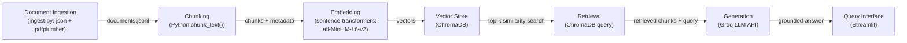

# Project 1 Planning: The Unofficial Guide

> Write this document before you write any pipeline code.
> Your spec and architecture diagram are what you'll use to direct AI tools (Claude, Copilot, etc.) to generate your implementation — the more specific they are, the more useful the generated code will be.
> Update the Retrieval Approach and Chunking Strategy sections if you change your approach during implementation.
> Update this file before starting any stretch features.

---

## Domain

<!-- What domain did you choose? Why is this knowledge valuable and hard to find through official channels? -->

Off-campus housing information for students at Howard University — covering available housing options, leasing requirements, and other logistics students face when looking for a place to live near campus. This knowledge is valuable because official university channels point students to a short, curated list of partner listings and don't surface the lived experience of actually renting near campus: how responsive a landlord is, whether a building is safe or well-maintained, or what hidden costs and requirements come up during leasing. This system pulls together tenant reviews from different housing and review websites so students can see that on-the-ground context in one place before choosing where to live.

---

## Documents

<!-- List your specific sources: URLs, subreddit names, forum threads, or file descriptions.
     Aim for at least 10 sources that together cover different subtopics or perspectives within your domain. -->

| # | Source | Description | URL or location |
|---|--------|-------------|-----------------|
| 1 | Howard Off-Campus Partners FAQ | Official FAQ on off-campus housing logistics and requirements | https://howard.offcampuspartners.com/resources/article/5524-frequently-asked-questions |
| 2 | The Lanes at Union Market | Tenant reviews scraped from the property's Google Maps listing | https://maps.app.goo.gl/gCeygqGkUtPsWzaG8 |
| 3 | Clover at The Parks | Tenant reviews scraped from the property's Google Maps listing | https://maps.app.goo.gl/MgDBBtSYtM8wjmuNA |
| 4 | Vie Towers | Tenant reviews scraped from the property's Google Maps listing | https://maps.app.goo.gl/DDBBFPmxp6Hbh5Pt5 |
| 5 | Trellis House Apartments | Tenant reviews scraped from the property's Google Maps listing | https://maps.app.goo.gl/qq3GdLDvdx2BRx3D7 |
| 6 | Howard Student Affairs housing tips article | Official guidance on finding housing near campus | https://studentaffairs.howard.edu/articles/6-tips-finding-campus-housing |
| 7 | The Lanes property info sheet | University-issued PDF describing The Lanes housing property | https://auxiliary.howard.edu/sites/auxiliary.howard.edu/files/2024-10/the%20lanes%20v2.pdf |
| 8 | Howard REDCAM (Real Estate Development & Capital Asset Management) | University department page on campus housing/real estate development | https://realestate.howard.edu/media/2396 |

---

## Chunking Strategy

<!-- How will you split documents into chunks?
     State your chunk size (in tokens or characters), overlap size, and explain why those
     numbers fit the structure of your documents.
     A review-heavy corpus warrants different chunking than a long FAQ. -->

**Chunk size:** 500 characters

**Overlap:** 100 characters

**Reasoning:** I checked the actual review text across clover.json, lanes.json, vie.json, and trellis.json. The median review is about 225 characters and roughly half of all reviews are under 200 characters, but some reviews run past 1,000 characters and a few go over 4,000. The FAQ and tips PDFs are made of longer paragraphs, usually a few hundred characters each. A 500 character chunk keeps most short reviews whole in a single chunk, so a one or two sentence review stays a complete, self-contained thought instead of getting cut in half. Longer reviews and PDF paragraphs get split into two or three chunks. I split on sentence boundaries instead of cutting at a raw character count, so a chunk never ends mid-sentence. The 100 character overlap (about 20 percent of the chunk size) means that if a specific fact sits right at a chunk boundary, it still shows up in the neighboring chunk instead of being lost between the two.

---

## Retrieval Approach

<!-- Which embedding model are you using (e.g., all-MiniLM-L6-v2 via sentence-transformers)?
     How many chunks will you retrieve per query (top-k)?
     If you were deploying this for real users and cost wasn't a constraint, what tradeoffs
     would you weigh in choosing a different embedding model — context length, multilingual
     support, accuracy on domain-specific text, latency? -->

**Embedding model:** all-MiniLM-L6-v2, run locally through sentence-transformers.

**Top-k:** 5

**Production tradeoff reflection:** If cost was not a constraint, I would consider a larger API-hosted model like OpenAI's text-embedding-3-large for better accuracy on casual, domain-specific review language, at the cost of per-request pricing, network latency, and sending data off the local machine.

---

## Evaluation Plan

<!-- List your 5 test questions with their expected correct answers.
     Questions should be specific enough that you can judge whether the system's response
     is right or wrong. "What are good dining halls?" is too vague.
     "What do students say about wait times at [dining hall name] during lunch?" is testable. -->

| # | Question | Expected answer |
|---|----------|-----------------|
| 1 | What time does the first weekday Clover at the Parks shuttle depart, and from which stop? | 6:00 AM, departing from Clover @ Park. |
| 2 | What time is the last weekend shuttle departure from the Lanes APT stop on The Lanes shuttle schedule? | 11:00 PM. |
| 3 | What do tenants say about who manages Clover at the Parks and about the leasing manager there? | Reviewers say Greystar took over management and describe the leasing manager, Chez, as responsive and helpful. |
| 4 | According to Howard's off-campus housing FAQ, what should a student do if someone asks them to send money before seeing the apartment or meeting the landlord? | Say no and report the scam to the Federal Trade Commission. |
| 5 | According to the same FAQ, what is the standard lease length for off-campus housing near Howard, and what other lease lengths are available? | A 12-month lease is the norm. Other options include 9-month, 6-month, sometimes 3-month, and month-to-month leases. |

---

## Anticipated Challenges

<!-- What could go wrong? Name at least two specific risks with reasoning.
     Consider: noisy or inconsistent documents, missing source attribution, off-topic
     retrieval, chunks that split key information across boundaries. -->

1. A good chunk of the Google review data has no written text at all, just a star rating. Across the four properties I collected, around 40 reviews out of roughly 300 are star-only. Those need to get filtered out during ingestion, since there is no text to embed, and if they slip through they would end up as empty or near-empty chunks that add noise without adding information.

2. Review lengths vary a lot, from a few words up to a few thousand characters. If I picked one chunk size without checking this, I could end up cutting long reviews into fragments that lose their meaning, or wasting most of a chunk's capacity on a one-line review. I looked at the actual character counts before picking a chunk size and overlap for this reason.

3. Several properties have reviews that could be confused with each other if source attribution is not solid. A review of Clover at the Parks and a review of Vie Towers could both mention "management" or "the leasing office," and if a chunk loses track of which property it came from, the system could answer a question about one building with facts about another. Every chunk needs to carry its source property and document name through the whole pipeline.

4. The Lanes shuttle schedule is a table inside a PDF, not plain text. Extracting it with a normal text extraction method jumbles the times and stop names together in a way that reads like nonsense. It needs to be parsed as a table and turned into full sentences before it can be chunked and embedded in a way that retrieval can actually use.

---

## Architecture

<!-- Draw a diagram of your pipeline showing the five stages:
     Document Ingestion → Chunking → Embedding + Vector Store → Retrieval → Generation
     Label each stage with the tool or library you're using.
     You can use ASCII art, a Mermaid diagram, or embed a sketch as an image.
     You'll use this diagram as context when prompting AI tools to implement each stage. -->

**Stages:**
1. **Document Ingestion** — `ingest.py` loads the Google review JSONs, the pre-structured shuttle-schedule JSON, the tabular schedule PDF, and the two article PDFs; strips nav/footer boilerplate and null-text reviews; writes unified records to `processed/documents.jsonl`.
2. **Chunking** — splits each cleaned document's `text` into fixed-size chunks (size/overlap TBD, see Chunking Strategy above) while carrying forward `doc_id`/`source`/`metadata` for attribution.
3. **Embedding + Vector Store** — each chunk is embedded with `all-MiniLM-L6-v2` via `sentence-transformers`, then stored in a `ChromaDB` collection alongside its metadata.
4. **Retrieval** — a user query is embedded with the same model and used for a top-k similarity search against the ChromaDB collection.
5. **Generation** — the retrieved chunks are inserted into a grounding prompt sent to a Groq-hosted LLM, which must answer only from the provided context; the answer and its source chunks are shown through a Streamlit interface.

---

## AI Tool Plan

<!-- For each part of the pipeline below, describe:
     - Which AI tool you plan to use (Claude, Copilot, ChatGPT, etc.)
     - What you'll give it as input (which sections of this planning.md, which requirements)
     - What you expect it to produce
     - How you'll verify the output matches your spec

     "I'll use AI to help me code" is not a plan.
     "I'll give Claude my Chunking Strategy section and ask it to implement chunk_text()
     with my specified chunk size and overlap" is a plan. -->

**Milestone 3 — Ingestion and chunking:** I will use Claude and give it my Documents section, my Chunking Strategy section, and my architecture diagram from this file. I will ask it to write a Python script that loads the review JSON files, the shuttle schedule JSON, the shuttle schedule PDF, and the two article PDFs, cleans out star-only reviews and PDF nav or footer text, and splits everything into chunks using the 500 character size and 100 character overlap I specified. To verify the output, I will print 5 sample chunks and check that none are empty, none contain leftover HTML or PDF junk, and each one carries the correct source property or document name.

**Milestone 4 — Embedding and retrieval:** I will give Claude my Retrieval Approach section and ask it to write code that embeds my chunks with all-MiniLM-L6-v2, stores them in ChromaDB along with their source metadata, and writes a retrieval function that returns the top 5 chunks for a query. To verify it, I will run my 5 evaluation questions through the retrieval function and check that the returned chunks actually mention the property, shuttle time, or FAQ fact the question is asking about, and that the distance scores on the top results are reasonably low.

**Milestone 5 — Generation and interface:** I will give Claude my grounding requirement (answer only from retrieved chunks, always name the source) and ask it to write a prompt template plus a Streamlit interface that sends the user's question and the retrieved chunks to the Groq LLM. Before running the generated code, I will read the system prompt myself to make sure it actually forces grounding instead of just suggesting it, and I will test it with a question my documents do not cover to confirm the system says it does not have enough information instead of making something up.
